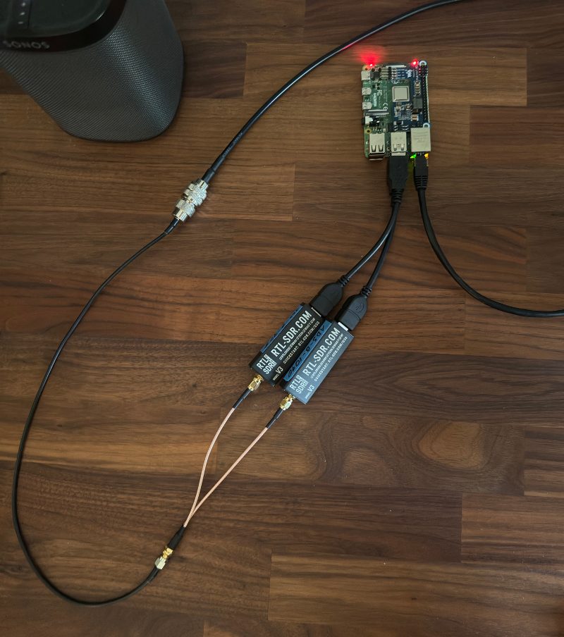
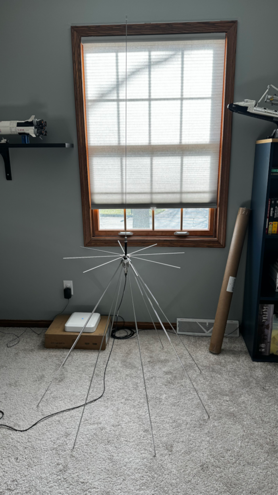

# Tracking Flights with ADS-B
Radio is cool. One day, I'll get my HAM license and actually talk to other people... but for now, I'm having a lot of fun just listening. This post covers how I setup an ADS-B feeder for FlightAware.

## What is ADS-B?
Automatic Dependent Surveillance-Broadcast (ADS-B) is a technology used for tracking aircraft. Most aircraft are required to transmit their telemetry, which we can receive, and plot on a map. This is the primary source of data for sites like [FlightRadar](https://www.flightradar24.com/), [FlightAware](https://www.flightaware.com/live/map), and [ADS-B Exchange](https://globe.adsbexchange.com/). You may register as a "Feeder" for these sites, and in exchange receive a premium subscriptions to their tools, and broader datasets. As a feeder for FlightAware, you get an [Enterprise](https://www.flightaware.com/commercial/premium/#subscriptions) subscription for free.  

Many of these sites offer out of box kits for purchase: [ADS-B Turnkey Feeder Bundle](https://store.adsbexchange.com/collections/frontpage/products/deluxe-dual-sdr-feeder-kit). Though I prefer, and opted, to build my own.

## The Hardware
Many of the items on this list are excessive. You can get by with simply: a Pi, an RTL-SDR dongle, and a cheap antenna. I added a 2nd receiver so that I could listen in the 978 MHz range associated with the UAT frequency. This is a cheaper alternative to 1090 MHz for use by general aviation craft. 

!!! note

    The __vast__ majority of aircraft are using 1090 MHz. Of all the aircraft I've tracked, 6% of them have been transmitting over 978 MHz.

My Hardware:

 - [Short USB Extensions](https://a.co/d/04jZBreV)
 - [SMA Splitter](https://a.co/d/0cGnkEcm)
 - [2x RTL-SDR v3](https://a.co/d/0d5nYy7S)
 - [Raspberry Pi 4B](https://www.microcenter.com/product/637834/raspberry-pi-4-model-b-4gb-ddr4)
 - [PoE Hat](https://a.co/d/0flXcGep)
 - [SMA Adapter](https://www.dxengineering.com/parts/cma-hm-05jsj)
 - [Discone Antenna MFJ-1868](https://www.dxengineering.com/parts/mfj-1866)

### RTL-SDR
These dongles are wildly popular, inexpensive receivers used for Software Defined Radio. There's a newer v4 model, but don't buy it for ADS-B. I've found the ADS-B driver support for the v3 model is much better (for now). Beware of knock offs. There's a whole section of RTL-SDR site dedicated to help you spot fake dongles [here](https://www.rtl-sdr.com/buy-rtl-sdr-dvb-t-dongles/).

### Discone Antennas
Discones are great for a wide variety of applications. AM/FM radio, ADS-B, Weather, Air Traffic Control... Anything transmitting in the 10s of MHz range, up to low GHz, A discone will be able to receive. It's overkill for this specific application, but I plan to use this antenna for more than just tracking planes overhead.

## The Software
Often with these DIY projects, the hardware is the fun part, and the software is utterly frustrating. For the most part, this was fairly straight forward for anybody who knows there way around Linux.

 - [RTL-SDR](https://github.com/osmocom/rtl-sdr)
 - [libusb](https://libusb.info/)
 - [RaspberryPi OS](https://www.raspberrypi.com/software/)
 - [dump1090](https://github.com/flightaware/dump1090)

Flashing an sd card with RaspberryPi OS is well documented. I'm not going to cover that here.

### libusb
From the [documentation](https://libusb.sourceforge.io/api-1.0/):

> libusb is an open source library that allows you to communicate with USB devices from user space.

Here's how to install

```bash
apt-get update
# Install libusb, along with cmake, git, and other software we'll need later
sudo apt install cmake pkg-config libusb-1.0-0 git
```

### RTL-SDR
This is the client software we need to actually tune into frequencies in the software. Hence, "Software Defined Radio".

```bash
sudo apt-get install rtl-sdr
```

Once installed, you should be able to run these commands.

#### `rtl_tcp`
Running `rtl_tcp` will configure your server to listen on the specified port. Then you can _tune_ into a frequency with client software like [gqrx](https://www.gqrx.dk).
```bash
# Setup server to listen on the specified address
rtl_tcp -a 192.168.1.1
```

#### `rtl_test`
From the man page:

> a benchmark tool for RTL2832 based DVB-T receivers

This is handy for listing the dongles, and getting their serial numbers:

```bash
tlofreso@sdr:~ $ rtl_test
Found 2 device(s):
  0:  Realtek, RTL2838UHIDIR, SN: 00001090
  1:  Realtek, RTL2838UHIDIR, SN: 00000978

Using device 0: Generic RTL2832U OEM
```

#### `rtl_eeprom`
This lets you program the chip on the dongles. Mostly useful for setting the serial numbers. By default, all RTL_SDRs come with the serial number set to `00000001`. For FlightAware, you'll want to change this to match the frequency the receiver will be tuned to.

```bash
# Connect a single dongle, set it to 1090
rtl_eeprom -s 00001090
# Save the settings, disconnect/reconnect and verify

# Connect the 2nd dongle by itself, set to 978
rtl_eeprom -s 00000978
# Save the settings, disconnect/reconnect and verify
```

### piaware and dump1090
This is the software needed to demodulate, and decode the data received from the aircraft. Here are the docs I followed to get this up and running: [PiAware Installation](https://www.flightaware.com/adsb/piaware/install)

Here are the configuration options available [PiAware 3 Advanced Configuration](https://www.flightaware.com/adsb/piaware/advanced_configuration)

Once installed, you can configure the software to use the appropriate dongles with these commands

```bash
sudo sed -i 's/^RECEIVER_SERIAL=.*/RECEIVER_SERIAL=00001090/' /etc/default/dump1090-fa
sudo sed -i 's/driver=rtlsdr[^ ]* /driver=rtlsdr,serial=00000978 /' /etc/default/dump978-fa
```

The install will create three services:

```bash
# sudo systemctl status piaware
# sudo systemctl status dump1090-fa
# sudo systemctl status dump978-fa
```

All the data is stored in a series of json files.

```bash
# 1090 data
cd /run/dump1090-fa

# 1090 archive
cd /run/tar1090

# 978 data
cd /run/skyaware978
```

Here's a sample of the data
```json
{ "now" : 1720376961.7,
  "messages" : 1256390,
  "aircraft" : [
    {"hex":"ac159a","alt_baro":28575,"alt_geom":30025,"gs":480.5,"track":72.8,"baro_rate":1216,"nav_qnh":1013.6,"nav_altitude_mcp":31008,"nav_modes":["autopilot","tcas"],"version":0,"nic_baro":1,"nac_p":10,"nac_v":2,"sil":3,"sil_type":"unknown","mlat":[],"tisb":[],"messages":15,"seen":11.1,"rssi":-26.3},
    {"hex":"a3d8be","flight":"EJA347  ","alt_baro":43000,"category":"A2","version":0,"nac_p":8,"sil":2,"sil_type":"unknown","mlat":[],"tisb":[],"messages":12,"seen":1.8,"rssi":-26.1},
    {"hex":"a20288","flight":"ATN3333 ","alt_baro":35000,"alt_geom":36750,"gs":516.5,"track":92.4,"baro_rate":64,"squawk":"6223","emergency":"none","category":"A5","nav_qnh":1013.6,"nav_altitude_mcp":35008,"nav_heading":99.8,"lat":41.393646,"lon":-81.901453,"nic":8,"rc":186,"seen_pos":0.5,"version":2,"nic_baro":1,"nac_p":10,"nac_v":2,"sil":3,"sil_type":"perhour","gva":2,"sda":3,"mlat":[],"tisb":[],"messages":209,"seen":0.2,"rssi":-24.6},
    {"hex":"ab00ae","alt_baro":40000,"alt_geom":41850,"gs":423.1,"track":276.9,"geom_rate":64,"nav_altitude_mcp":40000,"version":2,"nic_baro":1,"nac_p":10,"nac_v":1,"sil":3,"sil_type":"perhour","gva":2,"sda":2,"mlat":[],"tisb":[],"messages":55,"seen":0.2,"rssi":-23.8},
    {"hex":"a04e60","flight":"RPA4473 ","alt_baro":29000,"alt_geom":30525,"gs":487.2,"track":143.2,"baro_rate":64,"squawk":"3655","emergency":"none","category":"A3","nav_qnh":1013.6,"nav_altitude_mcp":29024,"nav_modes":["autopilot","vnav","tcas"],"lat":41.130295,"lon":-81.582031,"nic":8,"rc":186,"seen_pos":0.7,"version":2,"nic_baro":1,"nac_p":10,"nac_v":2,"sil":3,"sil_type":"perhour","gva":2,"sda":2,"mlat":[],"tisb":[],"messages":273,"seen":0.2,"rssi":-20.1},
    {"hex":"a9eca9","version":0,"sil_type":"unknown","mlat":[],"tisb":[],"messages":5,"seen":74.6,"rssi":-26.4},
    {"hex":"aca02f","flight":"EDV5482 ","alt_baro":33000,"alt_geom":34800,"gs":518.5,"track":84.4,"geom_rate":0,"squawk":"6024","emergency":"none","category":"A3","nav_qnh":1012.8,"nav_altitude_mcp":32992,"lat":41.002762,"lon":-81.723999,"nic":8,"rc":186,"seen_pos":0.5,"version":2,"nic_baro":1,"nac_p":10,"nac_v":1,"sil":3,"sil_type":"perhour","gva":2,"sda":2,"mlat":[],"tisb":[],"messages":778,"seen":0.2,"rssi":-20.2},
    {"hex":"a8b4cc","flight":"LXJ660  ","alt_baro":45000,"alt_geom":46925,"gs":553.1,"track":78.0,"baro_rate":0,"squawk":"6577","emergency":"none","category":"A3","nav_qnh":1013.6,"nav_altitude_mcp":45024,"nav_modes":["autopilot","althold","tcas"],"lat":41.214325,"lon":-81.870554,"nic":8,"rc":186,"seen_pos":0.7,"version":2,"nic_baro":1,"nac_p":10,"nac_v":2,"sil":3,"sil_type":"perhour","gva":2,"sda":2,"mlat":[],"tisb":[],"messages":623,"seen":0.0,"rssi":-23.5},
    {"hex":"a3c9c5","category":"A3","version":2,"sil_type":"perhour","mlat":[],"tisb":[],"messages":61,"seen":170.2,"rssi":-25.7},
    {"hex":"a33327","flight":"AAL1535 ","alt_baro":7800,"alt_geom":8150,"gs":278.2,"track":303.9,"baro_rate":-1408,"squawk":"7254","emergency":"none","category":"A3","nav_qnh":1018.4,"nav_altitude_mcp":4992,"nav_heading":310.1,"lat":41.101948,"lon":-81.838656,"nic":8,"rc":186,"seen_pos":50.6,"version":2,"nic_baro":1,"nac_p":9,"nac_v":1,"sil":3,"sil_type":"perhour","gva":2,"sda":2,"mlat":[],"tisb":[],"messages":911,"seen":50.6,"rssi":-22.2},
    {"hex":"a6c635","version":2,"sil_type":"perhour","mlat":[],"tisb":[],"messages":53,"seen":196.6,"rssi":-24.2},
    {"hex":"a5e9f4","category":"A3","version":2,"sil_type":"perhour","mlat":[],"tisb":[],"messages":376,"seen":105.4,"rssi":-27.1},
    {"hex":"aca3e6","category":"A3","version":2,"sil_type":"perhour","mlat":[],"tisb":[],"messages":1213,"seen":150.8,"rssi":-24.3},
    {"hex":"a97742","category":"A7","version":2,"sil_type":"perhour","mlat":[],"tisb":[],"messages":180,"seen":268.8,"rssi":-24.1},
    {"hex":"a6082f","category":"A2","version":2,"sil_type":"perhour","mlat":[],"tisb":[],"messages":1322,"seen":110.5,"rssi":-25.7},
    {"hex":"a64e67","category":"A3","version":2,"sil_type":"perhour","mlat":[],"tisb":[],"messages":993,"seen":149.3,"rssi":-25.7}
  ]
}
```

## The Final Setup
Here's what it looks like all put together.



Discone antennas are not small.



The software installed on the Pi gives you a local endpoint to hit that shows _only_ flights overhead.


51 out of 738


  
    
      

eeprom set serial number: https://discussions.flightaware.com/t/how-to-serialize-dongles-for-es1090-uat978/48147

Configure UAT 978: https://discussions.flightaware.com/t/easiest-way-to-add-978/59106/2

Piaware config settings in /etc/piaware.conf: https://www.flightaware.com/adsb/piaware/advanced_configuration


[^1]: In the US, aircraft may transmit in 