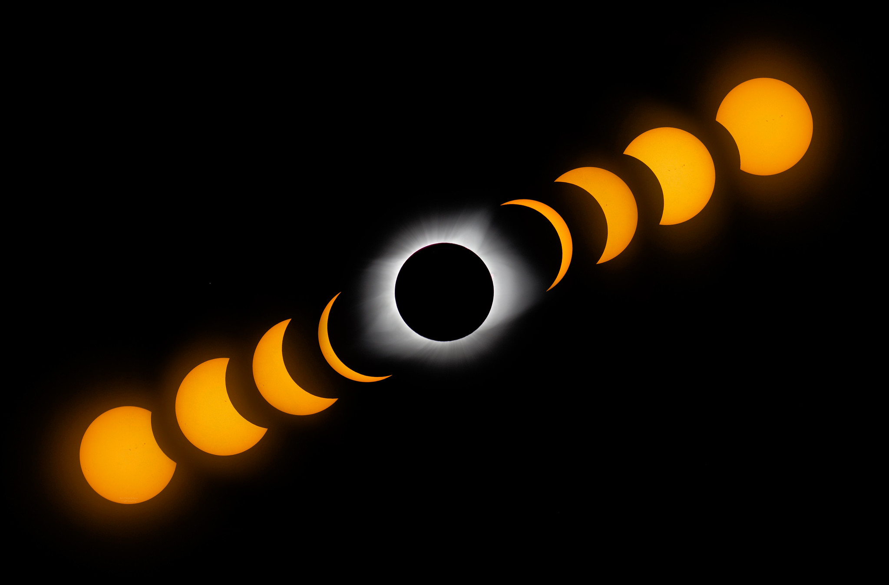

# My Plans for the 2024 Solar Eclipse
This post is mostly a collection of my notes from [here](https://github.com/tlofreso/2024-total-solar-eclipse){target=_blank} with a little more context throughout.  

If you haven't heard, there's going to be a [Total Solar Eclipse](https://science.nasa.gov/eclipses/future-eclipses/eclipse-2024/){target=_blank} across North America on April 8th [Get Hyped!](https://youtu.be/AwlGxVcVNNw?feature=shared){target=_blank} 🌑

<!-- more -->

I live near Cleveland, smack dab in the middle of totality. (yay!) There are many parks, and a massive lake to view the Eclipse from. There are also groups putting on events like the [Great Lakes Science Center](https://greatscience.com/explore/events-programs/total-eclipse-fest-2024){target=_blank}, and the [Cuyahoga Astronomical Association](https://cuyastro.org/the-total-solar-eclipse-of-2024/){target=_blank}.

> CAA members will bring telescopes, including solar telescopes.

What a generous gesture!

## Gear for Eclipse Day

### Glasses
You must have glasses that are `ISO 12312-2` certified. Buy them now, the price won't go down. Here are two options:  

 - [these](https://www.amazon.com/gp/product/B01N9T9CZL/ref=ppx_yo_dt_b_asin_title_o00_s00?ie=UTF8&psc=1){target=_blank} are the ones I bought
 - [these](https://www.eclipseglasses.com/collections/eclipse-glasses-stock?sca_ref=2753051.yTIACw5DUs){target=_blank} by American Paper Optics

### Apps
There are two apps available for free, with an in-app purchase for a guided tour / push notifications for the 2024 eclipse.

 - [Solar Eclipse Timer](https://www.solareclipsetimer.com){target=_blank} is the defacto standard for Solar Eclipse Apps.  
   
    {target=_blank}
    {target=_blank}  

 - [The Eclipse App](https://theeclipse.company/app){target=_blank} from The Planetary Society
   
    {target=_blank}
    {target=_blank}  

### Experiments

To Bring:  

 - A white sheet, lay it on the ground to view [Shadow Bands](https://en.wikipedia.org/wiki/Shadow_bands){target=_blank}   
 - A colander or hand held cheese grater for [Pinhole Projection](https://youtu.be/eNK2LI7VeX4?feature=shared&t=530){target=_blank}  
 - High contrast green/red boards for [Purkinje Effect](https://en.wikipedia.org/wiki/Purkinje_effect){target=_blank}  

## Helpful Resources

### Videos

 - [Smarter Every Day](https://youtu.be/eNK2LI7VeX4?feature=shared){target=_blank}   What you need to know
 - [Jeff Geerling](https://youtu.be/J-0i4wVHVdc?feature=shared){target=_blank}   How to shoot the eclipse 📷 (see below)
 - [NASA](https://www.youtube.com/live/2MJY_ptQW1o?feature=shared){target=_blank}   Official Broadcast on eclipse day

### Links

 - [Interactive google map](https://eclipse2024.org/eclipse_cities/statemap.html){target=_blank}  
 - [Smarter Every Day - Eclipse](https://www.smartereveryday.com/eclipse){target=_blank}  
 - [Smarter Every Day Checklist](./assets/EclipseChecklist2.pdf){target=_blank}  
 - [NASA 2024 Total Eclipse](https://science.nasa.gov/eclipses/future-eclipses/eclipse-2024/where-when/){target=_blank}  
 - [10 Rookie Mistakes](https://www.space.com/eclipse-chaser-rookie-mistakes-how-to-avoid-them){target=_blank}

## Locations

Ohio likely has the most people in totality outside of Texas.

 - If you're in Youngstown, drive 5 miles North
 - If you're in Canton, drive 5 miles North
 - If you're in Columbus, drive 10 miles North
 - If you're in Cincinnati, drive 15 miles North

### Potential Viewing Locations

#### [Sharon Nature Preserve](https://www.medinacountyparks.com/index.php/parks/nature-preserves/sharon-nature-preserve){target=_blank}  
6734 State Road  
Sharon Township, OH

134 acre property with open hay fields, and a wildflower meadow

#### [Silver Creek Disc Golf Course](https://www.summitmetroparks.org/silver-creek-metro-park.aspx){target=_blank}  
4579 Medina Line Rd.  
Norton, OH 44203

The Disc Golf Course is an open field. Another option would be the fields south of the pheasant run trail.

#### Maps
Path over Ohio  

Path over US  
